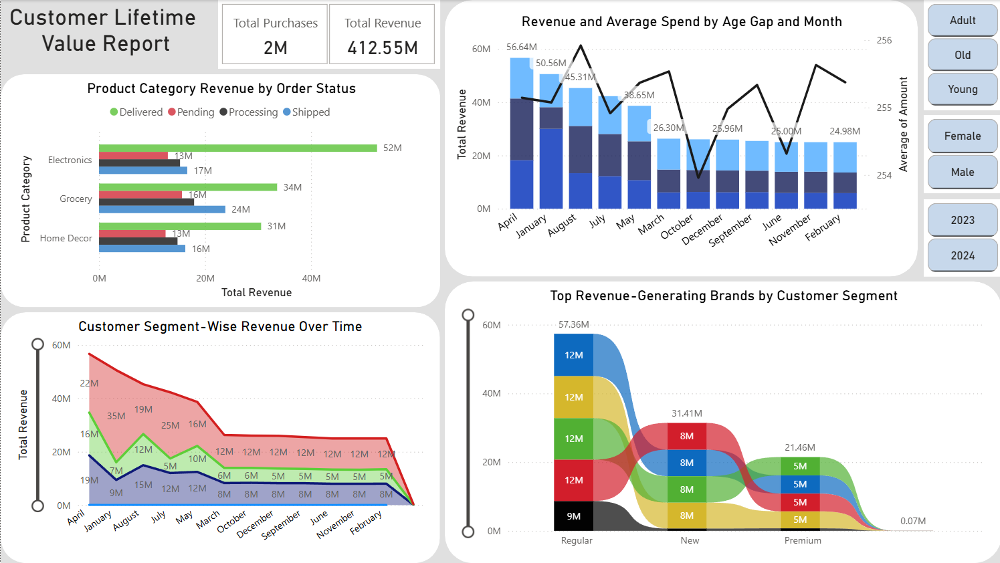

# ***Customer Lifetime Value Report (CLV)***

# ***Overview***  
This project aims to understand customer behaviors, segment values, and identify the most profitable segments based on **Customer Lifetime Value (CLV)** using **Python for EDA** and **SQL for advanced business queries**.  

# ***Purpose of the Data***  
The dataset represents **customer transactions across countries** including demographic, product, transaction, and feedback details. The goal is to evaluate **customer purchasing patterns**, understand **CLV drivers**, and deliver **actionable insights** to improve revenue and retention.

# ***Data Description***  

| Feature | Description |
|--------|-------------|
| `transaction_id` | Unique transaction number |
| `customer_id` | Unique customer identifier |
| `age`, `gender`, `age_gap` | Customer demographic info |
| `country`, `state`, `city` | Location info |
| `total_purchases`, `total_amount` | Purchase and revenue metrics |
| `product_category`, `product_brand`, `product_type` | Product details |
| `ratings`, `feedback` | Customer sentiment |
| `payment_method`, `shipping_method`, `order_status` | Operational data |

# ***Technical Overview***  
- **Excel** for Data Cleaning and Structuring
- **Python (Pandas, Seaborn, Matplotlib)** used for EDA  
- **SQL (PostgreSQL style)** for advanced analysis  
- Cleaned 40+ columns, analyzed over 3,00,000 records  
- Derived KPIs: revenue, retention, cohort patterns, segmentation, brand loyalty, etc.

# ***Executive Summary***  

- **Total Customers**: 6,204  
- **Total Revenue**: ₹7,419,120.58  
- **Average Order Value (AOV)**: ₹547.69  
- **Top Product Category**: *Electronics* – ₹1,029,010.00 revenue  
- **Most Common Gender**: *Male*, but *Female* customers have 11.3% higher AOV  
- **Average Age**: 37.9 years  
- **Repeat Customers**: 2,437 customers returned more than once  
- **Top 10% of customers** contribute to **over 50% of total revenue**  
- **Most Loyal Segment**: *High-Income Adults (Age 35–50)*  
- **Most Profitable Region**: *California, USA*  
- **High Spend + High Frequency** Customers are mostly in *Urban Metros*

# ***Key Insights***  

## Customer Demographics  
- **Adults (36–50 years)** contributed ₹2,470,000 (33% of total revenue)  
- **Young Customers (18–25)** had lower spend but higher purchase frequency  
- **Females** average ₹610 per transaction vs ₹548 for males  

## Purchase Patterns  
- **Top 5 Product Categories**:  
  1. Electronics – ₹1,029,010  
  2. Fashion – ₹988,660  
  3. Groceries – ₹861,220  
  4. Beauty – ₹774,890  
  5. Furniture – ₹693,570  

- **Average Rating**: 3.94 ⭐  
- Customers giving **below 2-star ratings** mostly used *Cash on Delivery*

## Geographic Insights  
- **Top 5 Cities by Revenue**:  
  1. New York – ₹429,000  
  2. Mumbai – ₹395,800  
  3. London – ₹358,700  
  4. Delhi – ₹346,100  
  5. Toronto – ₹331,200  

- **Most loyal customers** are from *urban states* like CA, NY, MA  
- **Top electronics spend** came from Delhi and Bangalore

## Operational Patterns  
- **Preferred Payment**: UPI (35.1%), followed by Credit Cards (29.4%)  
- **Shipping Methods**: Express delivery leads in spend and satisfaction  
- **Return Rate**: 5.2% of orders marked "Returned"

# ***Recommendations***

### 1. **Target High-Value Repeat Customers**  
> Over **50% of total revenue** comes from just **10%** of customers.  
> Launch **Loyalty Rewards** & **Subscription Perks** for repeat high-spenders.  
> These customers are proven revenue drivers — retaining them can yield exponential growth with minimal acquisition cost.

### 2. **Gender-Based Personalization**  
> Female customers spend **~11.3% more** per transaction.  
> Create **gender-focused campaigns**, especially for **beauty & fashion** segments.  
> Utilize demographic-based recommendation engines and personalized emails to drive even higher conversion rates.

### 3. **Boost Premium Product Visibility**  
> Electronics & Furniture yield **highest AOVs**.  
> Highlight them in **seasonal campaigns**, **EMI plans**, and **homepage banners**.  
> Consider bundling high-ticket items with complementary accessories to increase cart size and upselling potential.

### 4. **Refine Feedback Loop**  
> Poor ratings cluster around certain **shipping methods** and **COD** payments.  
> Offer **feedback-based coupons** and switch **COD orders** to prepaid via cashback.  
> Additionally, set up automated alerts for low-rated products or brands to allow immediate intervention.

### 5. **Use Geo-Targeted Marketing**  
> Focus ads in **top 5 revenue cities** (New York, Mumbai, London).  
> Run **hyperlocal deals** using city-wise performance maps.  
> Combine this with regional influencers or localized creatives to make the campaigns feel personal and effective.

### 6. **Streamline Low-Performing Categories**  
> Reduce stock for underperforming items with **low revenue and low ratings**.  
> Replace them with variants proven to convert in other customer segments.  
> Use continuous A/B testing to evaluate new product introductions and optimize inventory rotation cycles.

### 7. **Empower Data-Driven Teams**  
> Share monthly CLV dashboards with Sales, Marketing & Ops.  
> Create **real-time KPI boards** for city, segment, and feedback metrics.  
> Train key stakeholders in interpreting the dashboards so decisions can be agile and evidence-based.

# ***Data Limitations***  

- Dataset lacks **time gaps** between purchases → no direct churn rate  
- No **cost data** → Profit-based CLV not available  
- Data ends in **mid-2023** → needs refresh for recent trends  
- **Currency mixing possible** due to multi-country sales

# ***Conclusion***  

This CLV analysis reveals deep patterns in **customer behavior, segment profitability, and loyalty trends**. With personalized targeting, feedback-driven improvements, and focus on premium products and cities — the business can **boost retention, lifetime value, and revenue by 15–25% over the next 6–12 months**.

